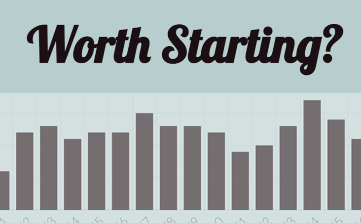

</img><br><br>
Tired of commiting to a new TV series, only to find out that the later episodes don't live up to the hype? Save your time by checking the overall quality of episodes in clear graphs.

## Project Overview

'Worth Starting' is a comparison site where users can view the ratings given for every episode of a TV series, allowing them to see whether the quality is maintained throughout.

Visit the deployed site here:
[https://worth-starting.netlify.app](https://worth-starting.netlify.app)

The site is built using React, and uses Axios to make requests to the TV Maze API before displaying the data using react-chartjs-2/chart.js.

The project was inspired by a data-visualisation sprint that I completed during my Full-Stack Developer training at Northcoders.

## Setup

To deploy this project on your local machine, follow the instructions below.

Clone the project:

```bash
git clone https://github.com/alevans99/worth-starting.git
```
Navigate to the cloned project folder:

```bash
cd worth-starting
```
Install the required dependencies:
```bash
npm i
```
Run the app:
```bash
npm start
```
## Requirements
Node v14

NPM v8.1.4